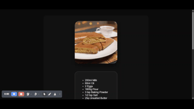

# Mystery Meal Game 

Welcome to the **mystery meal game** ; a simple game where one guesses the category or area of displayed food for 3 rounds and then sees their results.

## Technologies used 
This project was built using:
- Javascript (event-listeners,DOM manipulation and communicating with the server)

- HTML

- CSS
- External API [TheMealDB API](https://www.themealdb.com/api.php)


## Prequisites
Some prior knowledge of the following is recommended to fully understand and modify the code :
- JavaScript fundamentals (variables, functions, conditionals)
- Event listeners and DOM manipulation
- Communicating with the server
- Basic CSS - for styling (optional)
- HTML - for structuring

## Live Demo
Wanna try it out on your own [click here](https://moringa-sdf-pt10.github.io/Elvis-Mbuthia-meal-project/)

## How to play 

1. Click the Start Game button.

2. For each round, a meal is randomly fetched from  [TheMealDB API](https://www.themealdb.com/api.php) .

3. Guess either the category (e.g., Beef, Vegetarian) or the area (e.g., Italian, Mexican).

4. Receive feedback and score based on your answers.

5. After 3 rounds, see your total score and a summary of the meals.

## Setup Instructions

1. Clone into this repository into a preferred location
```
 git clone git@github.com:Moringa-SDF-PT10/Elvis-Mbuthia-meal-project.git
```
**Note** : this is for `ssh` enabled users if you have not setup ssh keys kindly use `https` instead.

2. Move into the repository
```
cd Elvis-Mbuthia-meal-project
```

3. Open the project:

- Open index.html in your preferred browser.

- Make sure you're connected to the internet (for the  API to work).

## Demo Preveiew


## Troubleshooting

### Setup
 - API not working locally

Some browsers block fetch requests from `file:// URLs` for security reasons.

Run a simple local server to test:

```
# Python 3
python3 -m http.server

# or with Node.js and http-server
npx http-server
```
Then visit http://localhost:8000 (or the port shown in your terminal).

### Product usage
- Meals not loading or game stuck at "Loading..."

    - Check your internet connection.

 

    - Open the browser console (F12) to check for fetch-related errors.

- Nothing happens when I click Start

    - Confirm that JavaScript is enabled in your browser.

    - Check if there are any errors in the browser console.

-  Layout looks broken

    - Try refreshing the page.

    - Ensure your browser supports modern CSS features (tested on latest Chrome and Firefox).

